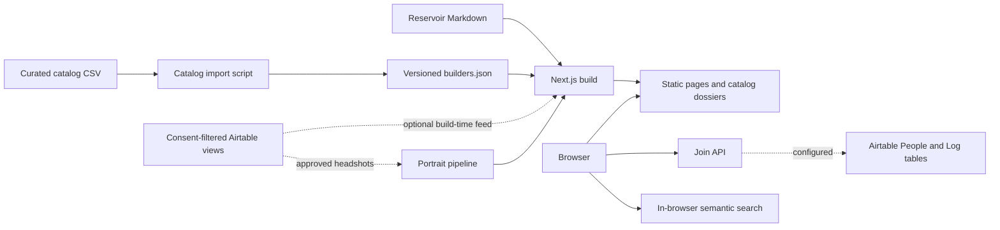

# YES Website

The public web experience for the Yale Entrepreneurial Society (YES). It combines a
scrollable interactive-globe launch, a portrait-first directory of Yale builders, The
YES Thesis, public writing and reporting, and a direct way into the community.

[View the live site](https://yesyale.org)

Built with Next.js 16, React 19, TypeScript, Tailwind CSS 4, SVG, and optional
server-side integrations with Airtable.

## Why this exists

An entrepreneurship community needs more than an events page. People need to see who
is building, understand the organization's point of view, find relevant peers, and
know how to participate. This site gives each of those jobs a focused surface while
keeping the experience visually coherent.

## Product highlights

- **Evidence-led launch** — the Wall Street Journal story about the Yale Hacker House
  opens the experience as a newspaper clipping beside a rotatable 3D light-field globe.
  New Haven and San Francisco are labeled and the reveal settles in under a second.
- **Portrait-first builder directory** — profiles with available images lead the wall,
  followed by deliberate monogram profiles. Semantic search runs entirely in the
  browser against vectors baked at build time, so
  intent-based queries like "helping blind people navigate" rank the right builders
  with no API key, no server round-trip, and no record of the query. Keyword ranking
  covers the case where the model cannot be fetched.
- **Shareable dossiers** — catalog entries open as intercepted modal routes during
  browsing and retain stable, server-rendered URLs for direct links.
- **Git-backed publishing** — essays, talks, workshops, lessons, and press entries are
  validated from Markdown at build time. External resources can appear in the same
  reverse-chronological index without being re-hosted.
- **Consent-aware data paths** — Airtable-backed public records are selected from
  consent-filtered views, re-checked in code, and reduced to explicit field allowlists.
- **Portraits with provenance** — the directory's portraits were collected from public
  pages rather than submitted, so each records the page it came from and can be removed
  by deleting one file. Builders without one render a monogram rather than a stand-in.
- **Honest program states** — Common Room replaces Aude and is visibly marked pending;
  the site does not imply that applications or cohort dates exist before they do.
- **Graceful local mode** — the public experience builds without third-party
  credentials. Optional forms, feeds, and processed portraits activate only when their
  configuration is present; search needs none of it.

## Pages

| Route | Purpose |
| --- | --- |
| `/` | 3D globe launch, WSJ hook, people preview, and complete Press section |
| `/thesis` | The YES Thesis and invitation to build |
| `/common-room` | Pending program status and the open path into YES |
| `/catalog` | Portrait-first builder directory and dossier browser |
| `/catalog/[slug]` | Direct, shareable builder dossier |
| `/reservoir/[slug]` | Locally hosted Reservoir entry |
| `/work` | Proof-point page. No longer linked from anywhere — reachable only by URL |
| `/enter` | General community intake form |
| `/builders` | Consent-gated ledger that stays dark below its minimum entry count |

`/manifesto`, `/aude`, and `/aude/apply` permanently redirect to the renamed public
routes. `/reservoir` redirects to the homepage Press section. `/work` and `/builders` remain
unlinked legacy routes; `/builders` is also gated by a minimum consented-entry count.

## Architecture



The application is static-first, not a static export. Content pages and dossiers are
generated at build time; the intake and search endpoints use the Node.js runtime so
credentials never need to reach the browser.

### Notable technical decisions

- **Human-triggered publishing.** Airtable feeds are read during a build, with no ISR
  or scheduled regeneration. A public-data change therefore requires a deployment.
- **Two catalog sources with different trust models.** The main catalog combines a
  version-controlled directory assembled from public sources with explicitly
  consented Airtable records. The consented record wins on a slug collision. The
  separate `/builders` ledger uses only the consent-gated Airtable view.
- **Validation at system boundaries.** Zod schemas validate form payloads on both the
  client and server. Reservoir frontmatter is validated during the build, and invalid
  entries fail rather than partially render.
- **Search without a server.** Builder vectors are baked at build time and the query is
  embedded client-side, both with `all-MiniLM-L6-v2`. This removes an API dependency, a
  per-search cost and a privacy surface at once, in exchange for a lazily-fetched model.
  `lib/catalog/embed-text.ts` is shared by the bake and the browser, because a drift
  between the two turns cosine scores into noise without failing anything.
- **The wall comes first.** Every builder is server-rendered beneath a short page
  introduction. Available portraits appear first, the grid filters immediately while
  typing, and the embedding model is fetched only when someone focuses the search.
- **Search cuts, browsing does not.** A search returns its strong matches only, capped at
  24, using a floor relative to the best score. Ranking the whole directory made every search
  look identical below the fold and implied a relevance the tail did not have. A floor of
  three results keeps a narrow query from returning nothing.
- **Build-time image treatment.** Portraits from either source are cropped and converted
  to color and duotone WebP files before the site build, avoiding expiring attachment
  URLs and browser-side filters.
- **Mechanical design constraints.** Repository scripts enforce the approved type
  scale and scan consented dossier copy for disallowed promotional language.

## Run locally

### Prerequisites

- Node.js 20.9 or newer (the minimum declared by the locked Next.js version)

```bash
git clone https://github.com/ariyannp07/YES-Website.git
cd YES-Website
npm ci
npm run dev
```

Open [http://localhost:3000](http://localhost:3000). No environment variables are
required for the public pages or checked-in catalog.

To enable integrations, copy the example file and add only the services you need:

```bash
cp .env.example .env.local
```

Never put an Airtable or xAI credential in a `NEXT_PUBLIC_` variable.

## Environment variables

| Variable | Required | Purpose |
| --- | --- | --- |
| `NEXT_PUBLIC_PALETTE` | No | Initial palette: `night` (default) or `paper` |
| `NEXT_PUBLIC_SHOW_PALETTE_TOGGLE` | No | Enables the review-only palette switcher |
| `AIRTABLE_TOKEN` | No | Server-side Airtable record access |
| `AIRTABLE_BASE_ID` | No | Airtable base used by feeds, forms, and audit logs |
| `AIRTABLE_PEOPLE_TABLE` | No | Overrides the default `People` table name |
| `AIRTABLE_LOG_TABLE` | No | Overrides the default `Log` table name |
| `AIRTABLE_CATALOG_VIEW` | No | Overrides the consented builder view name |
| `AIRTABLE_ALUMNI_VIEW` | No | Overrides the consented dossier view name |
| `INTAKE_LOG_OWNER` | No | Human owner recorded on intake audit rows |
| `XAI_API_KEY` | No | Enables server-side semantic catalog search |

When Airtable is absent, the catalog uses its version-controlled directory, the two
forms report that they are not connected, and `/builders` remains in its dark state.
When xAI is absent, the catalog continues to provide local text filtering.

## Commands

| Command | What it does |
| --- | --- |
| `npm run dev` | Starts the local Next.js development server |
| `npm run build` | Creates the production build |
| `npm run start` | Serves a completed production build |
| `npm run typecheck` | Runs TypeScript without emitting files |
| `npm run check:type-scale` | Rejects type sizes outside the shared scale |
| `npm run check:adjectives` | Scans the live Airtable dossier feed when configured |
| `npm run check` | Runs typecheck and both repository policy checks |
| `npm run build:portraits` | Generates static WebP portrait pairs from both portrait sources |
| `npm run embed` | Re-bakes catalog search vectors after the directory changes |
| `npm test` | Runs Vitest (the repository does not yet include test files) |

Regenerate the checked-in catalog after editing its source CSV with:

```bash
node scripts/import-catalog.mjs
```

## Repository map

```text
app/                    Pages, layouts, and request-time API routes
components/             Interactive and presentational components
content/catalog/        Version-controlled directory source and generated JSON
content/reservoir/      Git-backed editorial entries
content/manifesto.ts    Approved Thesis copy and rendering blocks (legacy filename)
lib/airtable/           Server-only Airtable reads, writes, and audit logging
lib/                    Content loaders, schemas, search corpus, and visual models
scripts/                Catalog import, portrait processing, and policy checks
```

## Content and deployment

See [Content, data, and release operations](docs/operations.md) for the Airtable
contract, catalog import workflow, portrait generation, Reservoir publishing, and the
pre-deploy review checklist.

This repository is an active implementation. The preview is deployed, but copy
approval, public-record review, integration configuration, and release checks remain
editorial responsibilities rather than assumptions made by the code.
